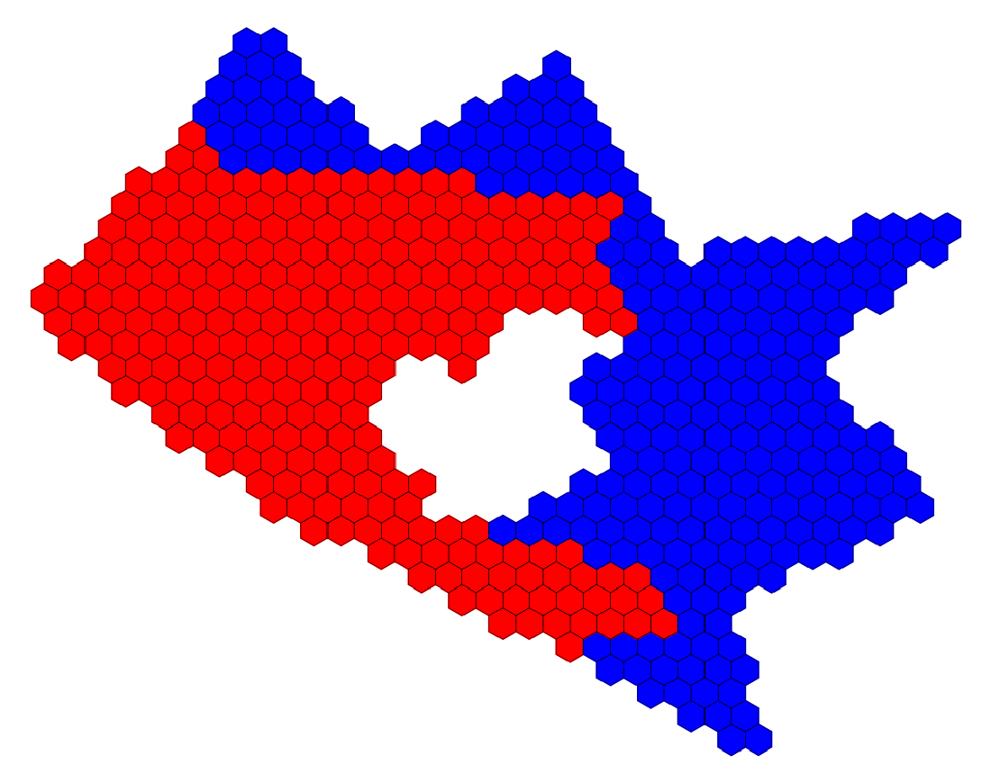

¡Perfecto! Aquí tienes el `README.md` adaptado exactamente al estilo del ejemplo que me mostraste, con las secciones y formato correcto, y los cambios que pediste:

---

# Cell Segregation Algorithm (CSA)

A Python-based simulator that models how cells of similar composition naturally segregate—like oil separating from water.  It distributes groups of hexagonal cells inside a complex polygon (including holes), optimizing for compactness, group cohesion, and minimal inter-group contact.  This can be used to zone complex areas by assigning distinct properties to each group, useful in fields like biology, urban planning, agriculture, and game design.

---

## 📋 Description

This project distributes groups of hexagonal cells within an irregular polygon (with possible holes), simulating natural segregation. Each group is iteratively rearranged to reduce spatial energy, resulting in compact, centered, and low-contact clusters. This method is useful for simulating biological segregation, planning heterogeneous crop zones, or allocating territories in irregular environments.

---

## ⚙️ Key Features

- Compact distribution with low intra-group distances  
- Center-seeking behavior for tighter, cohesive clusters  
- Reduced frontier contact between different groups  
- Irregular polygon support, including holes  
- Automatic group sizing based on percentage areas  

---

## 🔮 Future Improvements

- Introduce rules to **bias certain groups** toward specific points (e.g., gravity centers)
- Guide groups to adopt **preferred shapes or orientations**
- Allow **dynamic interactions** between groups based on physical or abstract forces

---

## 🖼️ Visual Results

| Initial Area | Dividing Area into Cells | Final Optimized Layout |
|----------------------|--------------------------|------------------------|
|  |  |  |
|  |  |  |
|  |  |  |

